# How It Works

`TriClipper` is based on the Vatti clipping algorithm.

## Example

We start with a simple example illustrating how the algorithm works.
A horizontal scan line moves from bottom to top and stops at every polygon
vertex and edge intersection. As a result of this operation, a collection of
monotone polygons is obtained as shown on the images below:


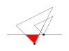


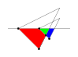

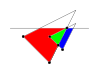

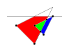

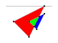

Sometimes, we need to take care about splitting ang joining the monotone
polygons. For example:


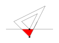

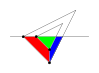

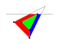

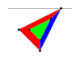

## Vertex type

Only vertices with integer coordinates are supported. For example:

```cpp
struct Vertex {
  uint32_t x;
  uint32_t y;
};
```

## Vertex order

We say that a vertex `a` is **less than** a vertex `b`, denoted by `a < b`, if
`a.y < b.y` or `a.y == b.y` and `a.x < b.x`.

## Edges

Polygon edges are oriented from bottom to top or, if horizontal, from left to
right. For example:


**Note:** For every edge `e`, it holds `e.start < e.end`.

## Local minimums

A local minimum of a polygon consists of the **root vertex**, the sequence of
**left-hand side edges** and the sequence of **right-hand side edges**.
Both edge sequences start at the root vertex.

The first left-hand side edge cannot be horizontal. The first right-hand side
edge can be horizontal.

The last left-hand side edge can be horizontal. The last right-hand side edge
cannot be horizontal.

For example:

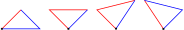

In the example above, the roots of the local minimums are marked with black
dots, the left-hand side edges are marked with red line segments and the
right-hand side edges are marked with blue line segments.

**Note:** If `l` and `r` are the first left-hand side edge and the first
right-hand side edge, respectively, it holds `l.start == r.start`. If `e0` and
`e1` are subsequent left-hand side or right-hand side edges, it holds
`e0.end == e1.start`.

## Scan line

A horizontal scan line moves from bottom to top and stops at every polygon
vertex and edge intersection.

We say that a local minimum starts on the scan line if its root vertex is on
the scan line.

## Active edges

A polygon edge is called **an active edge** if it is non-horizontal and
intersects the scan line, starts on the scan line or ends on the scan line.
An active edge is called **above the scan line** if it intersects the scan line
or starts on the scan line. An active edge is called **below the scan line** if
it intersects the scan line or ends on the scan line. For example:


In the example above, the red edge is above the scan line, the blue edge is
below the scan line and the black edge is both above and below the scan line.

Let `edge` be an active edge above the scan line and `x` be the X coordinate of
the intersection of the edge and the scan line or, if the edge starts on
the scan line, the X coordinate of the edge's start point. Active edges above
the scan line are sorted by `x` or, if the `x` values are equal, clockwise.
For example:


Similarly, let `edge` be an active edge below the scan line and `x` be the X
coordinate of the intersection of the edge and the scan line or, if the edge
ends on the scan line, the X coordinate of the edge's end point. Active edges
below the scan line are sorted by `x` or, if the `x` values are equal,
counter-clockwise. For example:


The order of collinear edges does not matter.

## Algorithm

### Find local minimums of the added polygons

Find the local minimums of all added polygons. The local minimums are sorted by
the Y coordinate of their root vertices or, if the Y coordinates are equal, by
the X coordinate of their root vertices. The order of local minimums for which
the root vertices coincide does not matter.

### Initialize scan line Y coordinates

We store the sorted list of scan line Y coordinates. The list is initialized
by the Y coordinates of the root vertices of the local minimums of all added
polygons. When the scan line moves upward, the Y coordinate of the previous
scan line position is removed from the list.

### Get the next scan line

Set the scan line at the smallest Y coordinate from the list of scan line Y
coordinates and remove the Y coordinate from the list.

### Find active edges

Find active edges **below the scan line**:

* The edges that used to intersect the scan line or start on the scan line at
its previous position are now **active edges below the scan line**.  

    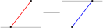

Find active edges **above the scan line**:

* The edges that used to intersect the scan line or start on the scan line at
its previous position and do not end on the scan line at its current position
are now **active edges above the scan line**.

    

* For every edge that used to intersect the scan line or start on the scan line
at its previous position and ends on the scan line at its current position,
non-horizontal edges that are connected to it are now **active edges above
the scan line**.

    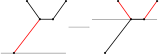

* For every local minimum that starts on the scan line, the first left-hand
side edge and the first non-horizontal right-hand side edge are now **active
edges above the scan line**.

    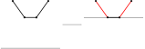

#### Horizontal edges

Active edges are never horizontal. Horizontal edges that are located on the scan
line are merged into a collection of **pairwise-disjoint closed intervals** and
stored separately from the active edges.

#### Collinear edges

Collinear active edges must be avoided. If two active edges above the scan line
are collinear, the edge that reaches higher is split into two parts, the part
that overlaps with the other edge is removed and the remaining part becomes
connected to the other edge. If the end points of the collinear edges have
the same Y coordinate, one of them is removed and the edges that are connected
to it become connected to the other edge. For example:


### Process active edges

For each active edge, let `x` be the X coordinate of the intersection point of
the edge and the scan line or, if the edge starts on the scan line, the X
coordinate of the edge's start point or, if the edge ends on the scan line,
the X coordinate of the edge's end point. Among the active edges that are not
processed yet, take the smallest value of `x`. For example:

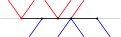

On the image above, the point on the scan line with the selected X coordinate is
marked with the red dot, the active edges above the scan line are marked with
red line segments, the active edges below the scan line are marked with blue
line segments and a horizontal edge on the scan line is marked with the black
line segment.

Process active edges that are connected with the red dot:

1. Add right-hand side vertices to the polygon on the left:

    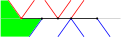

2. Add top vertices to the polygons below the scan line:

    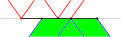

3. Add bottom vertices to the polygons above the scan line:

    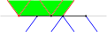

4. Add left-hand side vertices to the polygon on the right:

    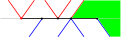

Next, among the active edges that are not processed yet, take the smallest value
of `x` and repeat the procedure above until all active edges are processed.

#### Split polygons

If there are no active edges below the scan line, the polygon on the left must
be split into two polygons. For example:


#### Join polygons

If there are no active edges above the scan line, the polygon on the left and
the polygon on the right must be joined. For example:


### Find edge intersections

Let the scan line be located at `y1` and let `y2` be the smallest Y coordinate
of edge's start point or end point such that `y2 > y1`. We need to find edge
intersections in the scan beam between `y1` and `y2`. Intersections that are
located at the bottom of the scan beam must not be included. Intersections that
are located at the top of the scan beam must be included. For example:


On the image above, the intersections that must be found are marked with red
dots.

To find the intersections, when the scan line is located at `y1`, iterate
the active edges above the scan line from left to right. Note that each active
edge intersects the top of the scan beam or ends at the top of the scan beam.

Take the first active edge and add it to the auxiliary list of edges called
the **sorted edge list (SEL)**. The edges in SEL will be sorted by decreasing
of the X coordinate of their intersection with the top of the scan beam or, if
an edge ends at the top of the scan beam, the X coordinate of its end point.
Edges with the same X coordinate are ordered by decreasing of the X coordinate
of their intersection with the bottom of the scan beam or, if an edge starts at
the bottom of the scan beam, the X coordinate of its start point.

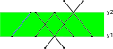

On the image above, the edge that is added to SEL is marked with the blue line
segment.

Take the next active edge.

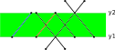

On the image above, the active edge is marked with the red line segment.

Take the first edge in SEL and observe that its intersection with the top of
the scan beam is to the left from the active edge's intersection with the top of
the scan beam (in our example, both edges end at the top of the scan beam, but
here and in what follows, if an edge ends at the top of the scan beam, we
consider its end point equivalent to an intersection of an edge and the top of
the scan beam). Since all edges in SEL intersect the bottom of the scan beam to
the left from the active edge, this means that the active edge does not
intersect with the first edge in SEL. In this case, we add the active edge to
SEL and continue.


On the image above, the edges in SEL are marked with blue line segments.

Take the next active edge.

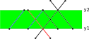

On the image above, the active edge is marked with the red line segment.

Take the first edge in SEL. Observe that its intersection with the top of
the scan beam is to the right from the active edge's intersection with the top
of the scan beam. This means that the active edge intersects the first edge
in SEL. In this case, we calculate the intersection and add it to the list of
edge intersections.


On the image above, the intersection is marked with the red dot.

Take the next edge in SEL. Observe that its intersection with the top of
the scan beam is to the left from the active edge's intersection with the top of
the scan beam. This means that the active edge does not intersect the edge
in SEL (as well as the next edges in SEL, all of which intersect the top of
the scan beam to the left from the active edge). In this case, we add the active
edge to SEL and take the next active edge.

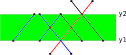

On the image above, the edges in SEL are marked with blue line segments and
the active edge is marked with the red line segment. The intersection that is
already added to the list of edge intersections is marked with the red dot.

The procedure above is repeated until all active edges are processed.

The summary of the algorithm looks as follows:

For each active edge above the scan line, iterate the edges in SEL to the first
edge that intersects the top of the scan beam to the left from the active edge
and, for each edge in SEL, add the intersection of the edge in SEL and
the active edge to the list of edge intersections. Then, add the active edge to
SEL and repeat the routine until all active edges are processed.

Note that if an edge in SEL intersects the top of the scan beam at the same
point where the active edge does, the edge in SEL may or may not intersect
the active edge. In this case, the edge in SEL intersects the active edge only
if none of these edges end at the top of the scan beam.

### Process edge intersections

When edge intersections in the scan beam between `y1` and `y2` are found, they
must be processed.

Let the scan line be located at `y1` and let `y` be the smallest Y coordinate
of an edge intersection such that `y < y2`. When the active edges at `y1` are
processed, the scan line is set at `y` and the active edges at `y` are
processed.

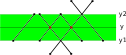

On the image above, the intersections that are located on the scan line at `y`
are marked with red dots.

The active edges below the scan line at `y` are the same as the active edges
above the scan line at its previous position `y1`. To find the active edges
above the scan line at `y`, take the active edges above the scan line at its
previous position `y1` and, for each intersection that is located on the scan
line at `y`, swap the intersecting edges.

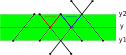

On the image above, the pairs of edges that must be swapped are marked with
red line segments and blue line segments.

When the active edges at `y` are found, they are processed as decribed in
[Process active edges](#process-active-edges).

The operation that is described above is repeated until all intersections below
the top of the scan beam are processed. For intersections that are located at
the top of the scan beam, the intersecting edges are swapped to preserve
the order of active edges above the scan line at `y2`.

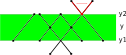

On the image above, the edges that must be swapped are marked with red line
segments.

### Summary

The summary of the algorithm looks as follows:

1. Find [local minimums](#local-minimums) of the added polygons.
2. Initialize the sorted list of scan line Y coordinates by the Y coordinates of
the roots of the local minimums.
3. Set the scan line at the smallest Y coordinate from the list of scan line Y
coordinates and [find active edges](#find-active-edges).
4. [Process the active edges](#process-active-edges).
5. For each active edge, add the Y coordinate of its end point to the sorted
list of scan line Y coordinates.
6. [Find edge intersections](#find-edge-intersections) in the scan beam between
the current scan line position and the next Y coordinate from the sorted list of
scan line Y coordinates.
7. [Process edge intersections](#process-edge-intersections) in the scan beam,
not including the intersections that are located at the top of the scan beam.
8. Set the scan line at the top of the scan beam and swap the active edges above
the scan line that intersect at the top of the scan beam.
9. [Find active edges](#find-active-edges) and repeat the steps 4-9 until all
edges of the added polygons are processed.
